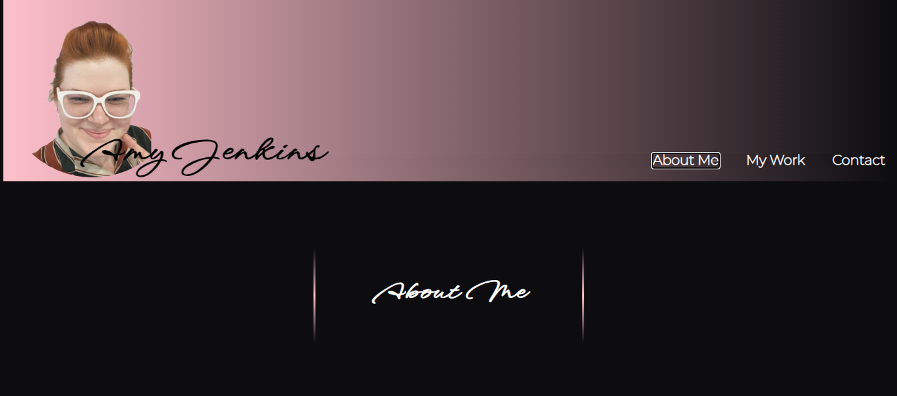

# <Portfolio>

## Description

This is a portfolio explaining a little bit about me and also showcasing some of my works, with this portfolio itself as part of my work. 

Through this project, I was able to learn how to add custom fonts, refine transition on hover effects, layering text over photos, and general using of flexbox.

## Installation

N/A

## Usage

The links in the navigation will take you to the different sections of the page. The links under "My Works" will take you to deployed pages of those works. The GitHub link under Contacts will take you to my GitHub pages where more and more projects will be added.

    

## Credits

For custom fonts: (https://fonts.google.com/)
For custom font woff generator: (https://www.fontsquirrel.com)

## License

